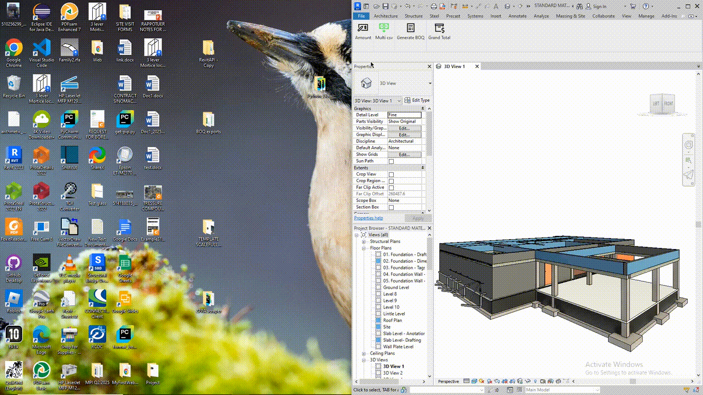

#  pyRevit Cost Estimates Extension

Automate quantity takeoffs and cost estimation inside Autodesk Revit with **pyRevit**.  
This extension reduces manual work by directly populating costs, generating Bills of Quantities (BOQs), and calculating totals from your model.

---

##  Features

- **Amount Population**: Automatically populate unit cost parameters (e.g., `Test_1234`) based on category.  
- **Generate BOQ**: Export structured cost breakdowns to Excel.  
- **Grand Total**: Summarize costs across all categories.  
- **Update Family Cost**: Sync family cost data using a CSV-based material pricing database.  

---
## Quick start (using the sample project)
1. Open: `assets/Sample test project.rvt`
2. In pyRevit, run: **Cost Update** → **Amount** → **Generate BOQ**  
   Your BOQ will be generated in three clicks.

## Update material unit costs
You can change unit prices directly from the panel:

1. **Press & hold `ALT`** and click **Cost Update** panel.  
2. Navigate to: `Multi csv` → `material costs/`  
3. Edit either file:
   - `material_unit_costs.csv`
   - `material_unit_cost2.csv`
4. Save your changes and re-run **Cost Update**.

> The sample project’s families are named to match the CSVs so updates apply immediately.

## Recipes (combine materials for composite costs)
Under the **Cost** panel, open **recipes**.  
This is where you define composite items by combining materials.  
**Example (Concrete):** cement + quarry dust + crushed stones + water + labor → concrete rate.

Once **recipes** and **material costs** are set, just:
1) **Cost Update** → 2) **Amount** → 3) **Generate BOQ** 

## Demo & test files

- Sample project: [assets/Sample test project.rvt](assets/Sample%20test%20project.rvt)
- Demo GIF:  
  
- Demo video: [assets/PyCostEstimate Demo video.mp4](assets/PyCostEstimate%20Demo%20video.mp4)

## Roadmap: live prices (no manual updates)
I’m building a web scraper that pulls **real-time prices from hardware websites**, packages them into a JSON file, and feeds the extension automatically—removing manual CSV updates.  
Preview data here: https://github.com/SwanaWJ/family-cost-data

## Supported Categories

The extension currently supports BOQ export and cost updates for the following Revit categories:

| Category                  | Unit of Measurement |
|----------------------------|---------------------|
| Structural Foundations     | m³                  |
| Block Work in Walls        | m²                  |
| Structural Columns         | m³ / m (by material)|
| Structural Framing         | m                   |
| Structural Rebar           | m                   |
| Roofs                      | m²                  |
| Windows                    | No.                 |
| Doors                      | No.                 |
| Electrical                 | No.                 |
| Plumbing                   | No.                 |
| Wall and Floor Finishes    | m²                  |

##  Installation

1. Make sure you have **[pyRevit installed](https://github.com/eirannejad/pyRevit/releases)**.  
2. Download **pyRevit Cost Estimates** from:  
    https://github.com/SwanaWJ/pyrevit-CostEstimates/archive/refs/heads/main.zip 
3. In Revit, go to the **pyRevit tab** → look at the **left-most panel** → click the small **drop-down arrow** (menu opens).  
4. Select **Settings** (pyRevit settings window opens).  
5. Navigate to **Add Folder** → browse to the folder where you downloaded/cloned `pyrevit-CostEstimates`.  
6. Click **Save Settings** and then **Reload**.  

 You should now see a new tab named **PyCostEstimates** in your Revit ribbon.

Good lucky!